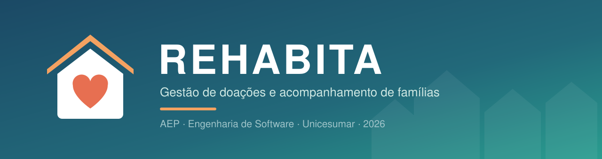

<p align="center">
  
</p>

<p align="center">
  <a href="#requisitos"></a>
  <a href="#regras-de-negócio"></a>
  <a href="#modelo-de-dados"></a>
  <a href="#cronograma"></a>
</p>

<p align="center">
  <b>Um lugar só para a doação que chega, a família que precisa e a ajuda que foi entregue.</b>
</p>

---

## Sumário

- [Sobre o projeto](#-sobre-o-projeto)
- [Objetivos de Desenvolvimento Sustentável](#-objetivos-de-desenvolvimento-sustentável)
- [Problemas que o sistema resolve](#-problemas-que-o-sistema-resolve)
- [Requisitos](#-requisitos)
- [Regras de negócio](#-regras-de-negócio)
- [Arquitetura](#-arquitetura)
- [Modelo de dados](#-modelo-de-dados)
- [Tecnologias](#-tecnologias)
- [Estrutura do repositório](#-estrutura-do-repositório)
- [Banco de dados](#-banco-de-dados)
- [Como executar](#-como-executar)
- [Cronograma](#-cronograma)
- [Convenções de desenvolvimento](#-convenções-de-desenvolvimento)
- [Equipe](#-equipe)

---

## Sobre o projeto

Paróquias, igrejas e projetos sociais de Maringá recebem doações (cesta básica, produtos de higiene, fraldas, roupas, cobertores) e repassam para famílias da comunidade que estão passando necessidade. Na maioria dos casos o controle fica em caderno, planilha ou grupo de WhatsApp. Funciona enquanto são poucas famílias, mas basta trocar o voluntário ou aumentar a procura para a informação começar a se perder.

O **REHABITA** organiza esse ciclo dentro da instituição: a doação chega e entra no estoque, a família é cadastrada e visitada, e o que foi entregue fica registrado no histórico dela.

| | |
|---|---|
| **Quem usa** | Coordenação e assistentes sociais/voluntários da instituição |
| **Quem não acessa** | Doadores e famílias assistidas |
| **Entidade principal** | Família (CRUD completo) |
| **Contexto acadêmico** | AEP do 4º semestre (2026) – Unicesumar, Maringá/PR |

Documento completo da 1ª entrega: [`docs/AEP2026_4_REHABITA.pdf`](docs/AEP2026_4_REHABITA.pdf)

---

## Objetivos de Desenvolvimento Sustentável

| ODS | Como o REHABITA contribui |
|-----|---------------------------|
| **1 – Erradicação da Pobreza** | Cada família tem status, histórico de visitas e data de retorno, então fica visível quem está há muito tempo sem atendimento. |
| **2 – Fome Zero** | O controle de estoque avisa que a cesta básica está acabando antes de faltar. |
| **10 – Redução das Desigualdades** | A lista de prioridade e o aviso de entrega repetida distribuem a ajuda por critério, não por ordem de chegada. |

---

## Problemas que o sistema resolve

| Dor | Por que acontece | Resposta do sistema |
|-----|------------------|---------------------|
| A informação da família se perde ou precisa ser perguntada de novo a cada visita. | Os dados ficam em cadernos, planilhas e conversas de WhatsApp, e cada voluntário tem a sua versão. | Cadastro único da família e dos membros (R1, R2). |
| Algumas famílias recebem duas vezes no mesmo mês e outras ficam sem nada. | Não existe um lugar onde dê para ver o que cada família já recebeu e quando. | Histórico de entregas e aviso de entrega repetida (R6, RN4). |
| Casos urgentes esperam na mesma fila que os outros. | Não há um jeito combinado de marcar urgência nem de lembrar quem precisa de retorno. | Nível de urgência, data de retorno e lista de prioridade (R3, R9, RN7). |
| A coordenação não sabe quanto tem em estoque nem quando algo vai acabar. | As doações chegam por vários lados e são guardadas sem anotar entrada e saída. | Registro das doações recebidas e saldo por item (R4, R5, RN3). |
| É difícil prestar contas para quem doou e para a própria instituição. | Nada liga o que entrou com o que foi entregue. | Doações e entregas ficam gravadas com data e responsável (R5, R6). |
| Não dá para saber quais bairros concentram mais famílias atendidas. | O endereço é anotado de qualquer jeito, então não dá para agrupar. | Bairro escolhido de uma lista e consulta por bairro (R1, R9). |

---

## Requisitos

| Nº | Requisito |
|:--:|-----------|
| **R1** | O sistema deve permitir o cadastro de famílias assistidas, com os dados do responsável (nome completo, CPF, data de nascimento, telefone, escolaridade e situação de trabalho), o endereço (CEP, rua, número, complemento e bairro), o tipo de moradia e a faixa de renda, além de consultar, editar e excluir esse cadastro. |
| **R2** | O sistema deve permitir o cadastro dos membros de cada família, com nome completo, data de nascimento, grau de parentesco com o responsável, telefone e CPF (esses dois opcionais), calculando automaticamente quantas pessoas moram na casa. |
| **R3** | O sistema deve permitir o registro dos atendimentos e visitas feitos a cada família, com data da visita, nível de urgência (baixa, média ou alta), usuário que atendeu, observações e data prevista para o retorno. |
| **R4** | O sistema deve permitir o cadastro dos itens distribuídos pela instituição (ex.: cesta básica, kit de higiene, fralda, cobertor), com nome, categoria (alimento, higiene, vestuário ou outros) e unidade de medida, mostrando o saldo atual em estoque de cada item. |
| **R5** | O sistema deve permitir o registro das doações recebidas, com data, doador (pessoa física, empresa, instituição ou doação anônima) e os itens com suas quantidades, somando essas quantidades ao estoque. |
| **R6** | O sistema deve permitir o registro dos itens entregues à família em cada atendimento, com a quantidade, descontando do estoque e mantendo o histórico de tudo o que a família já recebeu. |
| **R7** | O sistema deve permitir a alteração do status de acompanhamento da família (Novo, Em acompanhamento ou Inativo), guardando a data, o usuário e o motivo de cada mudança. |
| **R8** | O sistema deve permitir o cadastro de usuários (nome, CPF, telefone, e-mail, senha e perfil) e o login com e-mail e senha, com dois perfis: coordenador, que acessa tudo e é o único que cadastra usuários, itens e bairros, e assistente social, que trabalha com famílias, atendimentos, entregas, doações e consultas. |
| **R9** | O sistema deve permitir consultar as famílias por bairro, status e nível de urgência, gerar a lista de prioridade de atendimento e o relatório de saldo dos itens em estoque. |

---

## Regras de negócio

Implementadas na camada `service` e, quando possível, reforçadas por restrições no próprio banco.

| Código | Regra | Requisito |
|:------:|-------|:---------:|
| **RN1** | Não pode existir duas famílias com o mesmo CPF de responsável. Se o CPF já estiver cadastrado, o sistema mostra a família que já existe em vez de criar outra. | R1 |
| **RN2** | A quantidade de pessoas da família não é digitada: é o responsável mais os membros cadastrados. | R2 |
| **RN3** | O saldo de um item só muda por doação recebida (entrada) ou por entrega (saída), nunca é editado à mão. A entrega só é gravada se houver saldo suficiente, e o registro da entrega e a baixa no estoque são salvos juntos: se um falhar, nenhum dos dois é salvo. | R4, R5, R6 |
| **RN4** | Se a família já recebeu o mesmo item nos últimos 30 dias (a cesta básica costuma ser mensal), o sistema avisa. A entrega só continua se o atendimento estiver marcado com urgência alta. | R6 |
| **RN5** | Toda família começa com status Novo e passa para Em acompanhamento no primeiro atendimento. Qualquer mudança manual de status exige um motivo e fica gravada no histórico. | R3, R7 |
| **RN6** | Família que já tem atendimento registrado não pode ser excluída, só inativada, para não apagar o histórico de entregas. | R1, R7 |
| **RN7** | A lista de prioridade mostra as famílias que não estão inativas, ordenadas pela urgência do último atendimento e, em caso de empate, por quem está há mais tempo sem receber entrega. Família com status Novo entra como urgência média até receber a primeira visita. | R9 |

---

## Arquitetura

O sistema tem interface web, mas o núcleo é o back-end em Java: as classes, as regras de negócio e o acesso ao banco. Durante o desenvolvimento cada parte é testada por um menu de terminal e só depois ligada às páginas.

O código é dividido em camadas, cada uma com uma responsabilidade:

```
  páginas web / menu de terminal
              |
         controller          recebe a ação e devolve a resposta
              |
          service            regras de negócio (RN1 a RN7) e transações
              |
            dao              única camada que executa SQL
              |
         SQL Server
```

| Pacote | Responsabilidade | Exemplos |
|--------|------------------|----------|
| `model` | Guarda as classes do sistema (a parte de POO da seção 6). | Familia, Membro, ItemEntregue |
| `controller` | Recebe o que vem da página e devolve a resposta. | FamiliaController, AtendimentoController |
| `service` | Onde ficam as regras de negócio (RN1 a RN7). | FamiliaService, EntregaService |
| `dao` | A única parte que conversa com o banco de dados. | FamiliaDao, ItemDoacaoDao, UsuarioDao |
| `util` | Coisas usadas por várias camadas. | ValidadorCpf, SenhaUtil |
| `templates` | As páginas web e o menu de terminal usado nos testes. | familias.html, MenuTeste |

<details>
<summary><b>Ver diagrama de classes</b></summary>

<p align="center">
  
</p>

</details>

**Padrões aplicados**

- **MVC em camadas** — a interface não conhece SQL e o DAO não conhece regra de negócio.
- **DAO** — todos os DAOs implementam a interface genérica `Dao<T>` com `@Override`, expondo as cinco operações do CRUD: `inserir`, `buscarPorId`, `listarTodos`, `atualizar` e `excluir`.
- **Herança e polimorfismo** — `Pessoa` (abstrata) é herdada por `Responsavel`, `Membro` e `Usuario`; `MovimentacaoItem` (abstrata) é herdada por `ItemRecebido` e `ItemEntregue`, que sobrescrevem `aplicarNoEstoque()` de formas opostas (uma soma, a outra desconta).
- **Consultas parametrizadas** — todo acesso ao banco usa parâmetros, nunca concatenação de texto, o que previne SQL injection.

<p align="center">
  
</p>

> Arquivos editáveis (`.asta`) e em PDF na pasta [`docs/Diagramas/`](docs/Diagramas).

---

## claud Modelo de dados

11 tabelas no SQL Server. Correspondência entre as classes Java e as tabelas:

| Classe (Java) | Tabela | Observação |
|---------------|--------|------------|
| `Pessoa` | – | Classe abstrata: não vira tabela. |
| `Responsavel` | `familia` | Fica dentro da tabela da família. |
| `Membro` | `membro_familia` |  |
| `Usuario` | `usuario` |  |
| `Familia` | `familia` |  |
| `Bairro` | `bairro` |  |
| `HistoricoStatus` | `historico_status` |  |
| `Atendimento` | `atendimento` |  |
| `ItemDoacao` | `item_doacao` |  |
| `MovimentacaoItem` | – | Classe abstrata: não vira tabela. |
| `ItemRecebido` | `doacao_item` | Entrada no estoque. |
| `ItemEntregue` | `atendimento_item` | Saída do estoque. |
| `Doacao` | `doacao` |  |
| `Doador` | `doador` |  |

<p align="center">
  
</p>

Os scripts que criam essas tabelas ficam na pasta [`database/`](database) e são entregues no 2º bimestre.

---

## Tecnologias

| Camada | Tecnologia |
|--------|------------|
| Linguagem | Java 21 (LTS) |
| Framework | Spring Boot |
| Páginas | Thymeleaf |
| Banco de dados | SQL Server Express (porta 1433) |
| Acesso a dados | JDBC + driver `mssql-jdbc` |
| Build | Maven |
| Versionamento | Git / GitHub |
| Modelagem | Astah UML (classes) · SSMS (DER) |

---

## Estrutura do repositório

```
Re-habita---AEP-4-Semestre/
├── database/                      scripts SQL do banco (2º bimestre)
├── docs/
│   ├── AEP2026_4_REHABITA.pdf     documento da 1ª entrega
│   └── Diagramas/
│       ├── DIAGRAMA DE CLASSE.pdf / .asta
│       ├── DAO.pdf / .asta        organização do código em camadas
│       └── DIAGRAMA DO BANCO DER.png
├── src/main/
│   ├── java/br/com/rehabita/      código Java (2º bimestre)
│   │   ├── model/                 classes de domínio e enums
│   │   ├── controller/            recebe as ações da interface
│   │   ├── service/               regras de negócio (RN1 a RN7)
│   │   ├── dao/                   acesso ao banco de dados
│   │   └── util/                  ValidadorCpf, SenhaUtil
│   └── resources/
│       └── templates/             páginas HTML
├── .gitignore
└── README.md
```

> As pastas `src/` e `database/` já estão criadas e organizadas conforme as camadas descritas em [Arquitetura](#-arquitetura). Elas recebem o código Java e os comandos do banco no 2º bimestre. Como o Git não versiona diretório vazio, cada uma contém um arquivo `.gitkeep`.

---

## Equipe ❤️

| Integrante | Abreviação no cronograma |
|------------|--------------------------|
| Amanda Rodrigues Neves | Amanda |
| Julia Oliveira dos Santos | Julia O. |
| Julia Yumi Hashimoto | Julia Y. |

---

<p align="center">Projeto acadêmico desenvolvido para a Atividade de Estudo Programada (AEP) do curso de Engenharia de Software – Unicesumar, 2026.</p>
